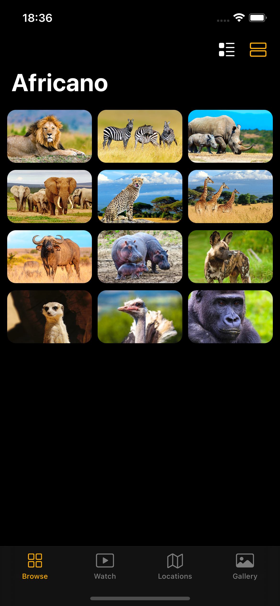

# Africano
A beautiful application with a complex layout for iPhone, iPad, and Macintosh devices. In this sample project, did discover not only Africa but many exciting iOS 14 features and some new programming concepts as well.

            
